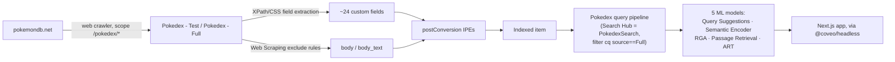
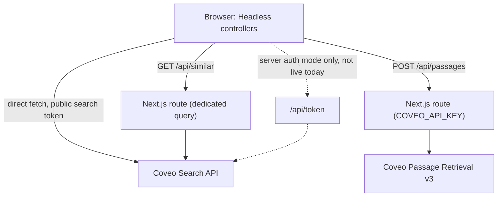

# Coveo Pokemon Challenge

Take-home assessment for a Coveo Forward Deployed Engineer role, built around two source documents in `docs/`: [`Pokemon Challenge (Pre-Sales) - 2026.txt`](docs/Pokemon%20Challenge%20%28Pre-Sales%29%20-%202026.txt) sets the four requirement tiers this repo builds against (Essential → Bonus); [`Technical_Challenge_-_FDE.pdf`](docs/Technical_Challenge_-_FDE.pdf) sets the panel format it gets presented in. Everything below is the technical answer to the first document, in the terms the second one expects: what was built, what it's configured against, what broke, and how.

Next.js + [`@coveo/headless`](https://docs.coveo.com/en/headless/latest/) search frontend over pokemondb.net.

**To evaluate this repo**, this file plus `docs/adr/` (24 short decision records) cover the architecture and the "why" behind it. `docs/handoff/` and `docs/archive/` are a session-by-session build log and superseded planning docs — real build history, kept for anyone who wants the "problem → iteration → fix" detail, but not required reading to judge the app.

## Status

Connected to a live Coveo org and deployed on Vercel: search, faceting (Automatic Facet Generation plus manual Speed/Abilities facets), Query Suggest typeahead, Generated Answer (RGA), a Pokemon detail page with a Similar Pokemon carousel, Passage Retrieval ("Ask about this Pokemon"), and a Compare view all work end to end against real indexed data. Open items and current state: `docs/handoff/STATE.md`.

**Live app**: [coveo-pokemon-assessment.vercel.app](https://coveo-pokemon-assessment.vercel.app/)

## Structure

- `src/` — Next.js + Coveo Headless SDK search frontend
- `docs/` — assessment instructions, the Coveo source/field-mapping spec, engineering standards adopted (`standards-adoption.md`), and architecture decision records (`adr/`) — see `docs/README.md` for an index
- `presentation/` — outlines for the two panel presentation topics
- `.claude/` — project agents/skills covering indexing, frontend, hosting, and presentation prep
- `tests/unit/` — Vitest unit tests, mirroring `src/`'s structure (`tests/unit/coveo/` for `src/coveo/`, etc.)
- `tests/e2e/` — Playwright e2e smoke tests

## The problem, tier by tier

The Pre-Sales challenge is one goal — index pokemondb.net and build a customized search page against it — cut into four tiers of increasing scope. Every bullet from the source doc is accounted for below, mapped to the real file or ADR that satisfies it.

| Tier | Requirement | Status | Where |
|---|---|---|---|
| Essential | Accept Cloud org invitation | Done | Org `venkatesh-pokemon-challenge` — `docs/handoff/STATE.md` |
| Essential | Install Headless (not Atomic) | Done | `@coveo/headless` — ADR-0001 |
| Essential | Crawl pokemondb.net, real Pokemon pages only | Done | `Pokedex - Full` source, 1025 items, scope `/pokedex/*` excl. Moves/Types/Abilities/Items — `docs/coveo-source-spec.md` |
| Essential | Connect local search page to the cloud endpoint | Done | `src/coveo/engine.ts`, `src/coveo/config.ts` |
| Essential | Type facet | Done | `AutomaticFacets.tsx` — ADR-0011 |
| Essential | Generation facet | Done | `AutomaticFacets.tsx`, `pokemongeneration` derived via IPE — ADR-0011 |
| Essential | Pokemon picture in search results | Done | `ResultList.tsx`, `pokemonimageurl` field |
| Intermediate | Host code on GitHub | Done | this repo |
| Intermediate | Host the search app, share the link | Done | Vercel — `docs/handoff/STATE.md` |
| Advanced | Deploy Coveo RGA | Done | `GeneratedAnswer.tsx`, `Pokedex RGA` model |
| Advanced | Preload Query Suggest | Done | `SearchBox.tsx`, `docs/DEFAULT_QUERIES.csv` (1070 rows) |
| Advanced | Pokemon Detail Page | Done | `src/app/pokemon/[name]/page.tsx` |
| Advanced | Two panel presentations | In progress | `presentation/topic1-technical-deepdive.md`, `presentation/topic2-escalation-recovery.md` |
| Bonus | Build on Passage Retrieval, have a POV | Done | `/api/passages` → `AskAboutPokemon.tsx` — ADR-0008, `docs/passage-retrieval-pov.md` |

## Configuration — the Coveo org as a pipeline

Two Coveo Web (crawler) sources feed one pipeline feed one set of ML models. The shape, end to end:



**Sources.** `Pokedex - Test` (3 items — Pikachu/Garchomp/Sprigatito, sandbox/prototyping) and `Pokedex - Full` (1025 items, the real crawl). Scope: inclusion `https://pokemondb.net/pokedex/*`; exclusions `/move/*`, `/type/*`, `/ability/*`, `/item/*`, the `/pokedex/national` index page, `/pokedex/stats/*` — per the challenge's own instruction to index only real Pokemon pages.

**Field extraction.** ~24 custom fields (identity, stats, training, breeding, type defenses) via XPath/CSS selectors against the page's `vitals-table`/type-defense tables. Two representative traps, full list in `docs/coveo-source-spec.md`: the vitals table has two `№` rows (National vs. Local dex number), needing positional truncation to isolate the right one; several rows render a value plus a `<small>` parenthetical (e.g. catch rate `45` then `(5.9% with PokéBall, full HP)`), needing an explicit `text()[1]` rather than the row's full text.

**IPEs.** Two org-level postConversion Python extensions: one derives `pokemongeneration` from `pokemondexnumber`'s numeric ranges; the other strips `pokemonweaknessesraw`/`pokemonresistancesraw`'s raw `@title` text down to the leading type name. A third extension, `Pokemon Type Effectiveness` (ADR-0023), appends a grounding sentence to `body_text` bucketing weak/resist/immune from the same raw data — added specifically because RGA/CPR only ever chunk `body`, never metadata fields, so a fact can be correctly extracted and faceting correctly while being completely invisible to the generative surfaces.

**Content exclusion.** Separate from field extraction — this trims what reaches `body`, i.e. what RGA/Passage Retrieval can retrieve from. Rules remove the Moves-learned table, the Type-defenses grid, the Locations/PokéBase block, alternate-form flavor-text noise, and accessibility skip-link boilerplate — each either already captured as a structured field or genuinely off-topic for grounding an answer. Full reasoning: ADR-0012, ADR-0020, ADR-0024.

**ML models**, all associated to the `Pokedex` pipeline:

| Model | Type | Purpose | Used by |
|---|---|---|---|
| `Pokedex Query Suggestions` | Query Suggestions | Typeahead suggestions as the user types | `SearchBox.tsx` |
| `Pokedex Semantic Encoder` | Semantic Encoder | Embeddings backing RGA's and Passage Retrieval's semantic retrieval | Indirect — no direct app call |
| `Pokedex RGA` | Relevance Generative Answering | Synthesized answer panel on `/search` | `GeneratedAnswer.tsx` |
| `Pokedex Passage Retrieval` (CPR) | Passage Retrieval | Raw scored passages for "Ask about this Pokemon" | `/api/passages` → `AskAboutPokemon.tsx` |
| `Pokedex ART` | Automatic Relevance Tuning | Boosts ranking of the ~5 best results per query, learned from click/search sequences | No app code — pipeline-level |

**Query Suggest preload, concretely**: a one-time `PUT /rest/organizations/<org>/machinelearning/models/<modelId>/configs/DEFAULT_QUERIES` call, payload `docs/DEFAULT_QUERIES.csv` — 1070 rows, all 1025 real indexed Pokemon names (pulled live from the Search API) plus 45 curated intent phrases.

**Why no Content Recommendation model** for "Similar"/"Recommended" Pokemon: Coveo's own guidance wants ~10,000+ historical queries for reliable output; this org's live usage-analytics volume was ~1,200 events all-time. Rather than ship a CR-backed surface that would effectively be guessing, the PDP's Similar Pokemon carousel is a deterministic same-type Search API query via `/api/similar` — no ML model, no cold-start risk. Full decision: ADR-0014.

**Traps that shaped this config** (full detail in `docs/handoff/STATE.md`'s "Documentation findings"):

- This org's Custom-purpose API keys are locked to predefined templates for `EXECUTE_QUERY`/Analytics-Push — not free-assignable, confirmed directly in the console's Privileges wizard (ADR-0006).
- Minting a search token needs `Impersonate` under owner `SEARCH_API` specifically; the Anonymous-search template's `Impersonate` is scoped to `USAGE_ANALYTICS` instead — a same-named but unrelated privilege (ADR-0007).
- Passage Retrieval is gated by `EXECUTE_QUERY`, not `ALLOW_CONTENT_PREVIEW` as originally assumed (ADR-0008).
- RGA/CPR only ever chunk/embed `body` — never metadata fields, which is why the Type Effectiveness IPE above exists (ADR-0023).

## Architecture — how the app consumes that config

A Next.js App Router frontend on `@coveo/headless`, run as a client-side SPA: every page builds its controllers against one shared `SearchEngine` singleton (`getSearchEngine()`, `src/coveo/engine.ts`), and Headless issues its own `fetch` calls to the Coveo Search API directly from the browser — no server rendering step in the search request path.

"No server layer" is the deliberate default (ADR-0004), with three narrow, individually ADR-documented exceptions where a Next.js API route exists specifically to keep a privileged key server-only:



- **`/api/token`** — mints a short-lived search token server-side (`server` auth mode only, not live today — ADR-0007).
- **`/api/passages`** — proxies Coveo's Passage Retrieval v3 endpoint for the PDP's "Ask about this Pokemon" feature (ADR-0008).
- **`/api/similar`** — a deterministic same-type query backing the PDP's Similar Pokemon carousel, server-side to avoid a second query colliding with the page's own shared engine, not for credential reasons (ADR-0014, ADR-0015).

Full request-lifecycle and controller-collision details: `docs/architecture/00-system-overview.md`.

### Headless controllers — what's used where

Every page builds its controllers against the same shared engine singleton — a facet toggled on `/search` and the `SearchBox` mounted persistently in `AppHeader` are not independent state, they're both subscribers to one store.

| Page | Controller | Built in | Purpose |
|---|---|---|---|
| Home | `buildQuerySummary` | `page.tsx` | Live indexed-item count |
| Home | `buildSearchBox` | `SearchBox.tsx` | Typeahead only — `onNavigate` redirects to `/search` |
| `/search` | `buildUrlManager` | `SearchUrlSync.tsx` | URL⇄state sync; also registers the `advancedSearchQueries` reducer |
| `/search` | `buildSearchBox` | `SearchBox.tsx` | Query text + typeahead + submit |
| `/search` | `buildAutomaticFacetGenerator` | `AutomaticFacets.tsx` | Type/Generation/Egg Groups/Weaknesses/Resistances |
| `/search` | `buildFacet` (searchable) | `FacetAbilities.tsx` | Abilities facet |
| `/search` | `buildNumericFacet` | `FacetSpeed.tsx` | Speed facet |
| `/search` | `buildQuerySummary`, `buildBreadcrumbManager`, `buildSort` | `SearchSummaryBar.tsx` | Result count, active-filter chips + clear all, sort dropdown |
| `/search` | `buildDidYouMean` | `DidYouMean.tsx` | Query-correction suggestion |
| `/search` | `buildGeneratedAnswer` | `GeneratedAnswer.tsx` | RGA |
| `/search` | `buildResultList` | `ResultList.tsx` | Results grid |
| `/search` | `buildPager` | `Pager.tsx` | Pagination |
| `/search` | `buildInteractiveResult` / `buildInteractiveCitation` | `ResultList.tsx` / `GeneratedAnswer.tsx` | Per-result / per-citation click analytics |
| PDP | `buildResultList` | `page.tsx` | Single-item result via an exact-match `aq`, not free text |
| PDP | `buildSearchBox` | `page.tsx` | Used only to reset text to `""` and `.submit()` — text never shown |

Every controller above is the real, installed `@coveo/headless` controller, confirmed against the package's own `.d.ts` files — no hand-rolled reimplementation of anything Headless already provides.

**Deliberate non-Headless counter-examples** — named so the pattern reads as a judgment call, not an oversight: `AskAboutPokemon.tsx` and `SimilarPokemon.tsx` are both plain `fetch` + local `useState` union (`idle`/`loading`/`error`/`success`), not Headless controllers — they call this app's own Next.js routes, not the Coveo Search API directly, so there's no engine state to subscribe to. `CompareProvider` is a third: plain React Context mirrored to `sessionStorage`, holding only Pokemon names, deliberately never search/facet/sort state.

**The subscription pattern**: `src/coveo/useControllerState.ts` is the one hand-rolled piece of infrastructure in the app. Every controller exposes `.state` + `.subscribe(listener)`, and this hook wraps that in React's `useSyncExternalStore` rather than the naive `subscribe()`-inside-`useEffect`-calling-`setState` pattern. Three non-obvious things it gets right: a bare `controller.subscribe` reference loses its `this` binding (called through the instance instead); Headless's `.state` getter builds a fresh object on every read, which trips React's "getSnapshot should be cached" check (fixed by caching the last snapshot in a `useRef`, refreshed only inside the subscribe callback); and the `subscribe` function passed to `useSyncExternalStore` needs a stable identity (`useCallback`), since Headless's `subscribe()` invokes the listener once synchronously on subscribe and an unstable identity causes an infinite resubscribe loop.

This exists because of a real bug, not speculative hardening: a controller's *constructor* can dispatch synchronously (`buildUrlManager`'s constructor synchronously dispatches `restoreSearchParameters`) — if that happens while a sibling component is mid-render, React throws "Cannot update a component while rendering a different component." This actually happened once `SearchBox` was duplicated into the persistent `AppHeader` layout alongside `/search`'s `SearchUrlSync`. The one deliberate exception is `SearchUrlSync.tsx` itself, which still uses raw `.subscribe()` + `useEffect` — correctly, since it drives `router.replace()` (a side effect, not React render state), so it was never in the vulnerable class this hook exists to fix.

## Problems hit, and how they were addressed

Config and code both threw up real, non-obvious failures during the build. A representative sample — full list in `docs/handoff/STATE.md`'s "Documentation findings" and "Traps" sections:

| Problem | Root cause | Fix | Reference |
|---|---|---|---|
| Token minting 403s unconditionally | Anonymous-search key's `Impersonate` scoped to the wrong owner (`USAGE_ANALYTICS`, not `SEARCH_API`) | Dual auth-mode (`direct`/`server`), `direct` live today | ADR-0007 |
| Every result missing images/type/generation, despite correct source config | Search API only returns a default field set unless custom fields are explicitly requested | `registerFieldsToInclude` dispatched once at engine construction | `src/coveo/engine.ts`, `docs/handoff/STATE.md` |
| `NEXT_PUBLIC_*` env vars read `undefined` in every production bundle | Next's build-time inlining only recognizes the literal `process.env.NEXT_PUBLIC_X` expression, not one reached through an indirected default | Literal expression preserved in `resolveCoveoConfig`'s default | `src/coveo/config.ts`, `docs/handoff/STATE.md` |
| Passage Retrieval 403ing | Wrong privilege assumed (`ALLOW_CONTENT_PREVIEW`) — the real gate is `EXECUTE_QUERY` | Switched to the key that actually holds `EXECUTE_QUERY` | ADR-0008 |
| RGA hallucinated extra weaknesses (Bug/Ghost) not in the real type chart | Stale embedding pool — the correct chunk existed in `body` but predated the exclusion-rule content in the index | Off-cycle RGA/Semantic Encoder/CPR rebuild, re-verified against the new cited chunk | ADR-0023, `docs/handoff/STATE.md` (session 44) |
| No reliable way to check "did my content change actually land" | Content Browser's Fields/Metadata view never includes `body`; Quick View renders `body_html`, not `body_text`; even `excerpt` reflects an earlier pipeline stage | Real keyword search against the Search API is the only trustworthy check | `docs/handoff/STATE.md` traps |
| Considered a Content Recommendation model for "Similar Pokemon" | Coveo's guidance wants ~10,000+ historical queries; this org has ~1,200 all-time | Deterministic same-type query via `/api/similar` instead — no ML model, no cold-start risk | ADR-0014 |
| Facet-ID collisions when hand-building five facet components | Manually building facets that automatic facet generation already covers duplicates state and risks ID clashes | Switched to real `buildAutomaticFacetGenerator` for the five highest-traffic facets | ADR-0011 |

## Search & facets

`/search`'s five highest-traffic facets (Type, Generation, Egg Groups, Weaknesses, Resistances) are served by Coveo's real **Automatic Facet Generation** (`buildAutomaticFacetGenerator`), not five individually hand-built facet components — the admin console's per-field **Facet Generator** option is enabled on those five fields, and `AutomaticFacets.tsx` derives its state fresh from each search response with no persistent per-mount registration. Two facets stay manually built for concrete reasons, not by default: Speed (`buildNumericFacet` — Automatic Facet Generation is STRING-only) and Abilities (`Facet.tsx` with `searchable` — hundreds of distinct values need facet-search, which automatic facets don't support). Full story, including the facet-ID-collision bug that motivated the switch: ADR-0011.

## Setup

```bash
npm install
cp .env.example .env.local   # fill in from the Coveo admin console
npm run dev
```

`.env.example` documents each variable, including the dual client auth mode (`NEXT_PUBLIC_COVEO_AUTH_MODE`, `NEXT_PUBLIC_COVEO_ACCESS_TOKEN`) and the two server-only keys (`COVEO_API_KEY`, `COVEO_ML_API_KEY`) — see ADR-0006 and ADR-0007 for why there are two of each. See `docs/coveo-source-spec.md` for the source/field configuration this frontend expects.

Without those env vars, the app builds and runs fine but shows a "Coveo isn't configured" banner instead of the search UI — required so `npm run build` / Vercel deploys succeed with no env vars set. For the detailed `src/` file map, see `AGENTS.md`.

## Testing

```bash
npm test              # Vitest unit tests
npm run test:coverage # Vitest with coverage (src/coveo/* + src/app/api/*/route.ts — see docs/standards-adoption.md #12)
npx playwright test   # e2e smoke tests
```

**Unit tests** (Vitest, `tests/unit/`, two projects — `node` for `src/coveo/*`/API-route tests, `jsdom` for component tests, see `vitest.config.mts`): cover `src/coveo/*` business logic (the result mapper, render-state derivation, error normalization, config resolution, sort/facet-range constants, type-color contrast checked against real WCAG math), all three server API routes (`/api/token`, `/api/passages`, `/api/similar`), and ~14 components with real branching logic — `Tabs`, `SearchUrlSync`, `CompareProvider`/`CompareTray`, `StatBar`, `Chip`, `Pager`, `PokemonMarkdown`, `Breadcrumb`, `TypeDefenses`, `EvolutionChain`, `DidYouMean`, `FacetSpeed`, `AutomaticFacets`, `SimilarPokemon`, `AskAboutPokemon`, `BrowseByType`. Purely presentational components (props straight to JSX, no branching) are deliberately untested — that's what e2e already exercises against a real org; see `docs/standards-adoption.md` #12/#12b for the full scoping rationale.

The coverage gate (80% statements/branches/functions/lines) is scoped to 8 named files, not a blanket repo-wide number: `src/coveo/mapPokemonResult.ts`, `applicationError.ts`, `searchRenderState.ts`, `config.ts`, `typeColors.ts`, plus `src/app/api/token/route.ts`, `passages/route.ts`, `similar/route.ts`.

**E2E tests** (Playwright, `tests/e2e/`, 5 specs): `unconfigured.spec.ts` — permanent smoke suite for the no-env-vars state, always runs; `search.spec.ts` — golden-path search + facets against the live org; `ask-about-pokemon.spec.ts` — Passage Retrieval golden path; `state-persistence.spec.ts` — Compare selection survives navigation, deep-linked facet URLs restore on a cold load; `a11y-motion.spec.ts` — reduced-motion override, focus-visible ring. The four configured-golden-path specs are `test.skip`-gated on `NEXT_PUBLIC_COVEO_ORGANIZATION_ID`, so they no-op without a live org configured.

## Engineering standards

This project selectively adopts a broader standards playbook (`docs/standards.md`, from a prior commerce Coveo project) rather than applying it wholesale — see `docs/standards-adoption.md` for what was adopted, adapted, or explicitly skipped and why, and `docs/adr/` for the architecture decisions behind this app's shape.

## Git hooks

`npm install` wires a pre-commit hook (lint + typecheck) via `scripts/install-hooks.mjs`. Run it once after cloning if hooks aren't active (`git config core.hooksPath` should show `.githooks`).

## CI

`.github/workflows/ci.yml` runs lint, typecheck, unit tests, and build on push/PR.

## Reference map

- `docs/README.md` — full index of everything under `docs/`
- `docs/handoff/STATE.md` — current org/app state, read first for anything live
- `docs/adr/` — all 24 architecture decisions referenced above
- `docs/architecture/` — system overview + one doc per page
- `presentation/` — the two panel presentation topics

## Learn more

- [Coveo Headless SDK docs](https://docs.coveo.com/en/headless/latest/)
- [Next.js documentation](https://nextjs.org/docs)
