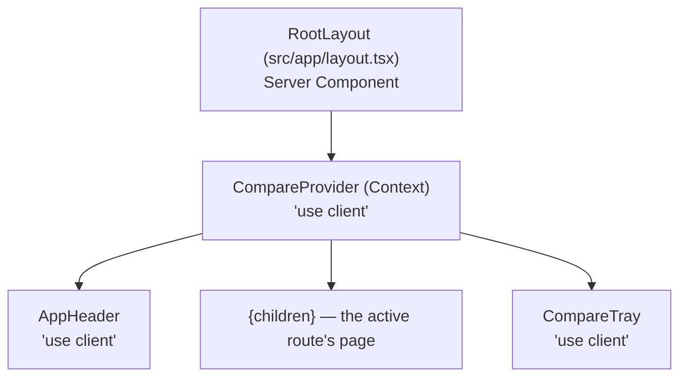
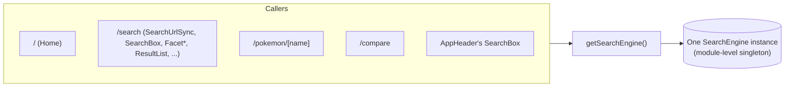
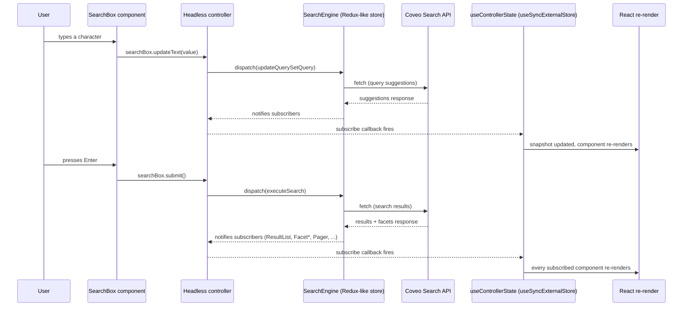

# System overview

## Root render tree

`layout.tsx` itself is a Server Component (no `"use client"` directive) — it only renders `<html>`/`<body>` chrome and font variables, nothing interactive. Everything below it that touches state is a Client Component. `CompareProvider` wraps the other three so `AppHeader`, every page, and `CompareTray` all share one Compare Context instance — see the [Context API](#context-api-usage) section below.

`AppHeader` renders a compact `SearchBox` only on `/pokemon/[name]` routes (`pathname.startsWith("/pokemon/")`); on every other route it's just the wordmark link. `CompareTray` renders nothing (`null`) when the Compare selection is empty, so on a cold visit to `/` it's invisible.

## The engine singleton

`src/coveo/engine.ts` holds one module-level `let engine: SearchEngine | undefined`. `getSearchEngine()` builds it lazily on first call and returns the same instance on every subsequent call — for the lifetime of the page (a full reload resets it, client-side navigation between `/`, `/search`, `/pokemon/[name]`, `/compare` does not).

Every page and component that needs Coveo state calls this same function:

Why this matters architecturally: **every Headless controller built anywhere in the app (`buildFacet`, `buildResultList`, `buildSearchBox`, etc.) is a view onto the same shared engine state.** A facet toggled on `/search` and a `SearchBox` mounted in `AppHeader` are not independent — they're both subscribers to one store. Two consequences that show up directly in the code:

- **Facet ID collisions across navigation, not just across components.** `buildFacet` defaults a controller's facet ID to its `field` name unless a `facetId` is given explicitly. Headless's `registerFacet` reducer never removes an entry once registered (only `disable()` exists, which doesn't deregister), so on this persistent single-engine architecture, unmounting `/search` and remounting it later (e.g. via the PDP breadcrumb back to `/search`) left the *previous* mount's facet registrations in place — the new mount's default-ID `buildFacet` calls found `"pokemontype"` etc. already taken and silently generated a suffixed ID (`pokemontype_2`, `_3`, ...) each time, warning `"A facet with field ... already exists"` and eventually producing a real React duplicate-key crash in the breadcrumb bar (two differently-ID'd, same-`field` breadcrumbs both keyed by field name). Fixed by pinning an explicit `facetId: field` on every remaining manual facet (`Facet.tsx`, `FacetSpeed.tsx`) — `registerFacet`'s reducer is a no-op when the id already exists, so a remount now reuses the existing registration instead of duplicating it. Full writeup: `docs/adr/0011-automatic-facet-generation-on-search-page.md`.
- **Most of `/search`'s facets are no longer hand-built at all.** `AutomaticFacets.tsx` (`buildAutomaticFacetGenerator`) replaced `FacetType`/`FacetGeneration`/`FacetEggGroups`/`FacetWeaknesses`/`FacetResistances` — its state derives fresh from the latest search response every read, with no persistent per-mount registration, so it's structurally immune to the collision class above. `FacetSpeed` (numeric) and `FacetAbilities` (needs facet-search) remain manual, still using the `facetId: field` fix. The home page's `BrowseByType` no longer builds a facet at all — it's a static list of the 18 real types (see [`01-home-page.md`](01-home-page.md)).
- **Cross-page dispatch races.** Multiple pages each dispatch their own `executeSearch` on mount against this one engine (`src/app/page.tsx`, `SearchUrlSync.tsx`, the detail page). Navigating between them while one is still in flight causes Headless to correctly cancel the stale one — its own request-cancellation logic, not a bug — but the logger reports every cancellation as `console.error`. `engine.ts` filters that one specific message narrowly (matched on exact text, documented as "fails open" if the message text ever changes) so it doesn't show up in a live demo.

Custom fields (`pokemontype`, `pokemonimageurl`, etc.) are registered once at engine construction via `loadFieldActions(engine).registerFieldsToInclude(...)` — without this, Coveo's Search API only returns a small default field set per result (facet aggregation still works independently, which is why this bug was invisible in the sidebar while breaking every result card and the PDP the first time it was missed).

## Config resolution

Two separate resolvers in `src/coveo/config.ts`, deliberately not one:

| | `resolveCoveoConfig()` | `resolveServerCoveoConfig()` |
|---|---|---|
| Runs in | Anywhere (plain module, works in Server Components too) | Server only — API routes exclusively |
| Reads | `NEXT_PUBLIC_COVEO_ORGANIZATION_ID`, `NEXT_PUBLIC_COVEO_AUTH_MODE`, `NEXT_PUBLIC_COVEO_ACCESS_TOKEN` | `COVEO_API_KEY`, `COVEO_ML_API_KEY` (never `NEXT_PUBLIC_*`) |
| Called by | `getSearchEngine()`, every page's `isCoveoConfigured()` check | `/api/token`, `/api/passages` only |
| Ships to the browser | Yes — by design, these are client-safe values | Never |

The client resolver has a load-bearing quirk worth knowing before touching it: its parameter default is written as the **literal** expression `process.env.NEXT_PUBLIC_COVEO_ORGANIZATION_ID` (repeated for each field), not `environment = process.env` with dynamic indexing. Next.js's build-time `NEXT_PUBLIC_*` inlining (webpack's `DefinePlugin`) only recognizes that exact literal syntactic pattern wherever it appears verbatim in source — a variable alias defeats it silently, with no build error, just `undefined` forever in the browser regardless of `.env.local`. This was a real, previously-shipped bug (see `docs/HANDOFF.md`'s D5 section) — any new `NEXT_PUBLIC_*` field added to this resolver must repeat the same literal form.

**Two auth modes** (`NEXT_PUBLIC_COVEO_AUTH_MODE`, see ADR-0007):

- **`direct`** (live today): the client uses a static `NEXT_PUBLIC_COVEO_ACCESS_TOKEN` as its Search API credential directly. In effect because this org's console currently can't issue an API key with the `Impersonate`-under-`SEARCH_API` privilege that server-minted tokens require.
- **`server`**: the client starts with an intentionally-invalid placeholder token; Headless's built-in renew-access-token middleware immediately 401s and calls `/api/token`, which mints a short-lived token server-side using the privileged `COVEO_API_KEY`. Fully built, not wired to org config today — switching is one env var, no code change (see `docs/adr/0007-dual-auth-mode-direct-vs-server-token.md`).

## Request lifecycle

This is also the answer to "why is everything client-side": Headless's `SearchEngine` is a browser-side SDK that maintains live, subscribable state and issues its own `fetch` calls directly to Coveo's Search API from the browser — there is no server rendering step in this path at all. The only server-side code in the whole app is the two narrow API routes below, and neither of them is in this request path for an ordinary search.

## `useControllerState` — the one hand-rolled piece of infrastructure

Every controller (`Facet`, `Pager`, `ResultList`, `SearchBox`, ...) exposes `.state` and `.subscribe(listener)`. The naive React pattern — `subscribe()` inside a `useEffect`, calling `setState` in the listener — has a real, previously-shipped failure mode: a Headless controller's *constructor* can dispatch synchronously (e.g. `buildUrlManager`'s constructor synchronously dispatches `restoreSearchParameters`), and if that happens while another component is mid-render, React throws "Cannot update a component while rendering a different component." This actually happened once `SearchBox` was duplicated into the persistent `AppHeader` layout alongside `/search`'s `SearchUrlSync` (see `docs/HANDOFF.md`, 8th session).

The fix, and the reason `src/coveo/useControllerState.ts` exists, is `useSyncExternalStore` — React's own mechanism for exactly this class of external-store synchronization hazard. Three non-obvious things the hook gets right so no call site has to re-derive them:

1. A bare `controller.subscribe` reference loses its `this` binding (a class method) — must be called through the instance.
2. Headless's `.state` getter builds a fresh object on every read, not a memoized value — handed straight to `useSyncExternalStore`'s `getSnapshot`, this trips React's "getSnapshot should be cached" infinite-loop detection. Fixed by caching the last snapshot in a `useRef`, refreshed only inside the subscribe callback.
3. The `subscribe` function passed to `useSyncExternalStore` must have a stable identity across renders (`useCallback`) — Headless's `subscribe()` invokes the listener once synchronously on subscribe, so a fresh identity every render causes an infinite resubscribe loop.

Every component that feeds Headless controller state into React render state goes through this one hook — confirmed directly (`grep` across `src/components`) rather than assumed: the only file still using raw `.subscribe()` + `useEffect` is `SearchUrlSync.tsx`, and correctly so — it drives `router.replace()` (a side effect, not React state), so it was never in the vulnerable class described above.

This hook is the *only* hand-rolled piece of "framework" code in the app. Every controller itself (`buildFacet`, `buildSort`, `buildGeneratedAnswer`, etc.) is stock `@coveo/headless`, not a custom reimplementation — a standing project rule (see `docs/HANDOFF.md`'s "Standing instruction" note) is to check Coveo's own docs/installed `.d.ts` files before hand-rolling anything, and every new controller usage was verified against the installed package types rather than assumed from prose.

## Context API usage

Exactly one React Context in the entire app: **`CompareContext`** (`src/components/compare/CompareProvider.tsx`), mounted once in `layout.tsx` so `AppHeader`, every page, and `CompareTray` share one instance. It holds only Pokemon *names* (capped at 4), mirrored to `sessionStorage` so a selection survives client-side navigation within the tab but never persists past closing it. Full detail in [`04-compare-page.md`](04-compare-page.md).

Search/facet/sort/pagination/RGA state is **never** held in React Context or component state as the source of truth — that state lives entirely inside Headless controllers on the shared engine, and components read it via `useControllerState`. This is a meaningful distinction to make to an audience familiar with typical React apps: there's no Redux store, no custom global-state library, and no prop-drilling scheme for search state, because Headless's controller model already is the state layer.

## No-server-layer constraint and its three exceptions

ADR-0004 sets "no server layer" as the default — this is a client-only Headless app, not a Next.js app using its backend capabilities for business logic. Three narrow, each individually ADR-documented exceptions exist:

- **`/api/token`** (`src/app/api/token/route.ts`) — mints a short-lived search token server-side using `COVEO_API_KEY`, so a privileged key is never shipped to the browser. Only exercised in `server` auth mode (not live today, see above). ADR-0005.
- **`/api/passages`** (`src/app/api/passages/route.ts`) — proxies Coveo's Passage Retrieval v3 endpoint for the PDP's "Ask about this Pokemon" feature, again so `COVEO_API_KEY` stays server-only. Includes a basic in-memory per-IP rate limiter. Uses `COVEO_API_KEY`, not `COVEO_ML_API_KEY`, because live testing found the endpoint needs `EXECUTE_QUERY`, not content-preview privileges — see ADR-0008.
- **`/api/similar`** (`src/app/api/similar/route.ts`) — a deterministic same-type Search API v2 query backing the PDP's Similar Pokemon carousel (`SimilarPokemon.tsx`), server-side to avoid a second engine/query colliding with the page's own single shared engine, not for credential-privilege reasons like the other two. ADR-0014/ADR-0015.

All three routes share `resolveServerCoveoConfig()` and the same `SEARCH_HUB`/`PIPELINE` constants (`src/coveo/searchConfig.ts`) as the client engine, so hub/pipeline names can't silently drift between client search and these server calls.

## How the app evolved (brief timeline)

Full detail in `docs/HANDOFF.md` — this is only the shape of it, so the "why does this look the way it does" question has an answer without re-reading nine sessions of history:

1. **v2.1 → v2.2** — Coveo org field expansion: 21 new Pokemon fields (stats, training, breeding, defenses, evolution) added to the `Pokedex - Test` source, then ported to `Pokedex - Full` (1025 items).
2. **v2.3** — this frontend, built in 7 sequential steps: data contract (`PokemonItem` reshaped into grouped sub-objects), shared UI primitives (`Chip`/`StatBar`/`DataList`/`Tabs`), PDP rebuild, Compare feature, `/search` (facets/sort/RGA), home + `AppHeader`, docs sync.
3. **8th/9th session hardening** — a real `SearchBox` crash (`useSyncExternalStore` migration, above) and a real console error (`executeSearch/rejected` race), both root-caused and fixed rather than suppressed blindly, plus the `useControllerState` hook extraction so the fix applies uniformly instead of per call site.
4. **10th session — v3 track + facet architecture** — fixed a `sortCriteria` URL-encoding bug (`SearchUrlSync.tsx`'s fragment serializer used `URLSearchParams.toString()`'s `+`-for-space convention, which Headless's own `%20`-based deserializer never un-escapes) that broke every sort option, not just an unsortable field; added Egg Groups/Weaknesses/Resistances facets and a Speed sort; then found and fixed the facet-ID-collision bug above, which prompted replacing 5 of `/search`'s facets with Coveo's real Automatic Facet Generation and the home page's live facet grid with a static list (`docs/adr/0011-automatic-facet-generation-on-search-page.md`) — plus a second, unrelated pre-existing bug that surfaced along the way: `/search` never registered Headless's `advancedSearchQueries` reducer, so an `aq` URL param silently did nothing until fixed.
5. **18th–23rd sessions — deploy, then a design-and-content pass driven by live product review, not a fixed spec.** Vercel deploy went live (18th). Real marketing assets + icon-based `BrowseByType` replaced placeholder content (19th/20th, `docs/EXECUTION-PLAN-marketing-assets.md`). The PDP gained a Similar Pokemon carousel backed by a new `/api/similar` route, once an ART-vs-Content-Recommendation decision was resolved (20th, ADR-0014/ADR-0015). A home hero carousel and standalone `PdpHighlights` were built, then both reverted after live review the same session — the carousel treatment moved to `BrowseByType` instead, and `PdpHighlights`' one real field (`generation`) folded into `PokemonHero`/the Overview tab (21st, ADR-0017). Facet swatches picked up real type-icon art and the facet rail was reordered Type-first (21st, ADR-0018), and a stale `aq` category filter that survived a new search box query — with no UI to clear it — was found and fixed (23rd, ADR-0018).

Nothing in the current build is speculative or aspirational — every controller, field, and route described in these docs was confirmed by reading the actual file, not inferred from a plan doc.
