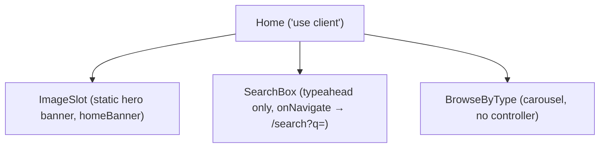

# `/` — Home page

Source: `src/app/page.tsx`

## Component tree



The hero is a single static banner (`ImageSlot name="homeBanner"`), not a carousel — a rotating-banner version was built and reverted the same session after live review found it competed with `BrowseByType`'s own carousel for the same affordance with no extra real content to justify it. See [ADR-0017](../adr/0017-home-hero-reverted-to-static-banner-pdp-highlights-folded-in.md).

`AppHeader` and `CompareTray` also render around this page (from the root layout, see [system overview](00-system-overview.md)), but `AppHeader` shows no `SearchBox` on `/` — that only appears on `/pokemon/[name]`.

The page's container is `max-w-7xl`, matching `AppHeader`'s and `CompareTray`'s width (widened from `max-w-6xl` for consistency, same pass as ADR-0017 — applied to `/search`, `/compare`, and the PDP too).

## Controllers and the engine

Two controllers below run against the one shared `getSearchEngine()` singleton (`src/coveo/engine.ts`) — this page doesn't build its own engine. `BrowseByType` no longer builds a controller at all (see below).

| Controller | Built by | Purpose |
|---|---|---|
| `buildQuerySummary` | `Home` (`page.tsx:41`) | Live indexed-item count (`summaryState.total`) |
| `buildSearchBox` | `SearchBox.tsx` (internal to the shared component) | Typeahead suggestions only — `onNavigate` intercepts submit/select and does a router push instead of executing in place |

### Why the live count isn't `executeFirstSearch()`

`page.tsx:45-53` dispatches a guarded, direct `executeSearch` (via `loadSearchActions`) on mount rather than calling the engine's own `executeFirstSearch()` convenience method. `executeFirstSearch()` has a `firstSearchExecutedSelector` guard that silently no-ops after the engine's first search *anywhere in its lifetime* — since the engine is a page-lifetime singleton shared across routes, a second visit to `/` later in the same session (after having already searched on `/search`) would show a stale count. The `hasSearched` ref guards against React Strict Mode's double-invoke, not against revisits.

An empty query means RGA's "Query is not empty" condition never fires here — nothing on this page waits on it.

## Browse by type — a static-data carousel, not a live facet

As of `docs/adr/0011-automatic-facet-generation-on-search-page.md`, `BrowseByType.tsx`'s data is static: `POKEMON_TYPES` (`src/coveo/typeColors.ts`), the 18 real Pokemon types, hardcoded. This replaced an earlier version that built a real `buildFacet` against an empty query purely to read live type/count pairs. Hardcoding the type *names* isn't fabricated Pokemon data — types are a fixed, closed, real taxonomy, not a per-Pokemon fact being invented — but it does mean this grid no longer shows a live count next to each type (an accepted tradeoff; `/search` itself still shows real, live counts once landed).

The presentation has changed twice since: a text-`Chip` grid, then icon "pins" using real downloaded type-icon SVG art (`public/art/types/`, MIT-licensed) instead of flat colored chips, then — once `SimilarPokemon.tsx` established the pattern on the PDP — an `embla-carousel-react` carousel with prev/next arrow buttons (`CarouselArrowButton`/`useCarouselArrows`) instead of the earlier `overflow-x-auto` drag-only strip. Each icon is still paired with its type's real name as text below it, the same color-plus-label rule applied everywhere else in the type-driven design system (ADR-0013) — an icon or color alone is never the only identifier.

Each type renders as a `Link` (icon badge + text label, colored via `getTypeColor` for the hover ring, a decorative-only convention — see below), wrapped by `buildTypeSearchHref(type)` (`src/coveo/browseByTypeUrl.ts`):

```
/search?aq=%40pokemontype%3D%3D%22Fire%22
```

This is an `aq` (advanced query) expression — `@pokemontype=="Fire"` — not a facet-scoped `f-<facetId>=<value>` param. It used to be the latter, but `/search`'s Type facet is now Coveo's Automatic Facet Generation (`AutomaticFacets.tsx`, see [`02-search-page.md`](02-search-page.md)), which has no facetId and would never see a `f-pokemontype=` param at all — that link would have silently filtered nothing. `aq` doesn't depend on any facet being registered; it's the same exact-match pattern already used by the Pokemon detail and compare pages, and it *is* correctly restored by `/search`'s `SearchUrlSync` (a real, unrelated bug — `/search` never registered Headless's `advancedSearchQueries` reducer, so `aq` silently did nothing before this was fixed in the same change).

## Static vs. dynamic

| Static (app-authored) | Dynamic (live Coveo data) |
|---|---|
| Page copy ("Search every Pokemon indexed from pokemondb.net, powered by Coveo.") | Indexed item count (`summaryState.total`) |
| `TYPE_COLORS` palette (`src/coveo/typeColors.ts`) — a documented fan-site/Bulbapedia color convention, decorative only, always paired with the text label, never color alone | Search-box typeahead suggestions (Query Suggest ML model) |
| `POKEMON_TYPES` (`src/coveo/typeColors.ts`) — the 18 real types, hardcoded; a fixed real taxonomy, not fabricated per-Pokemon data | — |
| Route strings (`/search?aq=...`) | — |

No fabricated Pokemon *data* is presented on this page (no invented name/stat/generation) — the type taxonomy itself is hardcoded (a closed, real, non-Pokemon-specific list), and it no longer shows live per-type counts, an accepted tradeoff for dropping the live facet query (see [ADR-0011](../adr/0011-automatic-facet-generation-on-search-page.md)).

## Client vs. server

The whole page is `"use client"`. Reasons, concretely:

- Needs `useRouter()` for the `onNavigate` redirect to `/search`.
- Needs live, subscribable Headless controllers, which only exist in the browser (Headless's `SearchEngine` issues its own `fetch` calls client-side — see [system overview](00-system-overview.md#request-lifecycle)).
- Needs `useState`/`useEffect`/`useRef` for the mount-search guard.

There is no server-rendered data-fetching path here (no `getServerSideProps`-equivalent, no server component reading Coveo data) — this is a deliberate consequence of ADR-0004's no-server-layer default, not an oversight.

## Context API

None used directly on this page. `CompareProvider`'s context is ambient (mounted in the root layout) but nothing on `/` reads or writes it.
