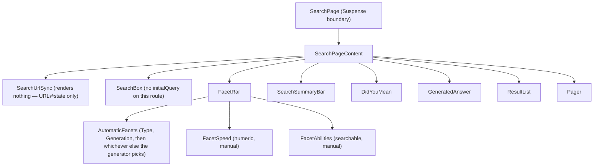
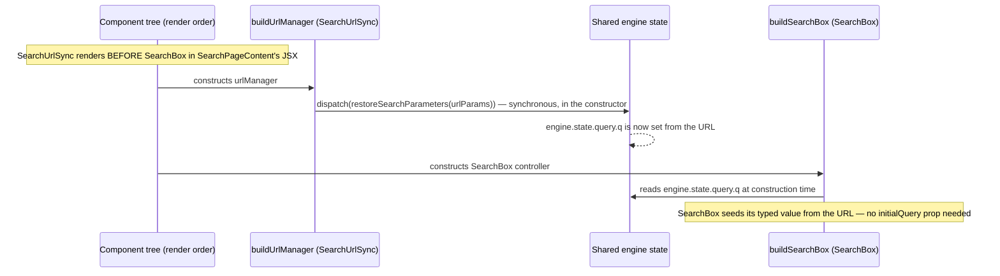

# `/search` — Search results page

Source: `src/app/search/page.tsx`

This is the most control­ler-dense page in the app and the riskiest one to get sequencing wrong on — worth walking through slowly in a demo.

## Component tree

As of `docs/adr/0011-automatic-facet-generation-on-search-page.md`, 5 of the 7 facets on this page (`Type`, `Generation`, `Egg Groups`, `Weaknesses`, `Resistances`) come from one `AutomaticFacets` component built on Coveo's real Automatic Facet Generation, not 5 separate hand-built `Facet.tsx` wrappers. `FacetSpeed` (numeric — Automatic Facet Generation is STRING-only) and `FacetAbilities` (needs facet-search, which automatic facets don't support) remain individually hand-built. `AutomaticFacets` leads `FacetRail`'s DOM order (Type first, then Generation, then whichever other fields the generator selects), with the two manual facets after — reordered from an earlier version that put the manual facets first, per [ADR-0018](../adr/0018-search-facet-filter-ux-corrections.md). Its `Type`/`Weaknesses`/`Resistances` values render through `TypeSwatch.tsx`, using the same real type-icon SVG art as `BrowseByType` and result cards (a selected-state ring instead of the checkmark a flat color swatch used to need), same ADR.

The `Suspense` wrapper around `SearchPageContent` exists because both `SearchUrlSync` and `ResultList` call `useSearchParams()` — a real Next.js requirement (missing-suspense-with-csr-bailout), not a stylistic choice.

## Every controller in play

All controllers below run against the one shared `getSearchEngine()` singleton.

| Controller | Built in | Purpose |
|---|---|---|
| `buildUrlManager` | `SearchUrlSync.tsx:46` | Owns query/facet/sort ⇄ URL sync. Also registers the `advancedSearchQueries` reducer (`loadAdvancedSearchQueryActions`) before constructing — without it, an `aq` URL param (e.g. the home page's Browse-by-type pills) silently never reached the Search API, a real pre-existing bug found and fixed in the tenth session |
| `buildSearchBox` | `SearchBox.tsx` (shared component, no `initialQuery` on this route) | Query text + typeahead + submit |
| `buildAutomaticFacetGenerator` | `AutomaticFacets.tsx:39` | Type/Generation/Egg Groups/Weaknesses/Resistances — Coveo's real Automatic Facet Generation. `desiredCount: 6`, `numberOfValues: 10`. State derives fresh from the latest search response every read; no persistent per-mount registration, so it can't hit the facetId-collision bug class below |
| `buildFacet` (field `pokemonabilities`, `searchable` prop, `facetId: "pokemonabilities"`) | `FacetAbilities.tsx` → `Facet.tsx` | Abilities facet — uses `facet.facetSearch.updateText()`/`.search()` for a searchable list (hundreds of distinct values, a plain checkbox list is unusable). Kept manual since `AutomaticFacet` has no facet-search API |
| `buildNumericFacet` (field `pokemonspeed`, `facetId: "pokemonspeed"`) | `FacetSpeed.tsx:20` | Speed facet, **explicit** ranges (`generateAutomaticRanges: false`). Kept manual — Automatic Facet Generation is STRING-only |
| `buildQuerySummary` | `SearchSummaryBar.tsx:19` | Result count text |
| `buildBreadcrumbManager` | `SearchSummaryBar.tsx:20` | Active-filter chips + "Clear all" — now renders 3 breadcrumb arrays (`facetBreadcrumbs`, `numericFacetBreadcrumbs`, `automaticFacetBreadcrumbs`), keyed by `breadcrumb.facetId` (not `.field` — two facets can legitimately share a field under different ids) |
| `buildSort` | `SearchSummaryBar.tsx:21` | Sort dropdown |
| `buildDidYouMean` | `DidYouMean.tsx:10` | Query-correction suggestion |
| `buildGeneratedAnswer` | `GeneratedAnswer.tsx:31` | RGA — wrapped in try/catch, org-gated |
| `buildResultList` | `ResultList.tsx:18` | The results grid itself |
| `buildPager` | `Pager.tsx:9` | Pagination |
| `buildInteractiveResult` (per result) | `ResultList.tsx:78` | Click-through analytics per card |
| `buildInteractiveCitation` (per citation) | `GeneratedAnswer.tsx:154` | Click-through analytics per RGA citation |

Every one of these is the real, documented `@coveo/headless` controller — confirmed against the installed package's `.d.ts` files during the build session, not a hand-rolled equivalent (see [system overview](00-system-overview.md#usecontrollerstate--the-one-hand-rolled-piece-of-infrastructure)).

## The one sequencing subtlety worth knowing cold

`buildUrlManager`'s constructor synchronously dispatches `restoreSearchParameters` from the current URL. A `SearchBox` controller seeds its own typed value from `engine.state.query.q` **at construction time**. Because `<SearchUrlSync>` appears before `<SearchBox>` in `SearchPageContent`'s JSX, its controller constructs first, so by the time `SearchBox` constructs and reads that engine state, the URL's `q` param is already there — no `initialQuery` prop is passed to `<SearchBox>` on this route (unlike the home page, which does pass one for its own redirect-then-seed flow). Reorder these two components and this silently breaks: query text from a deep-linked URL would stop restoring into the visible search box.

This is also the origin of the crash story: `SearchBox` is *also* mounted persistently in `AppHeader` (compact version, on `/pokemon/[name]` only, not `/search` — so it doesn't collide here — but the general hazard of a controller notifying an already-rendering sibling is what forced the `useControllerState`/`useSyncExternalStore` migration described in the [system overview](00-system-overview.md#usecontrollerstate--the-one-hand-rolled-piece-of-infrastructure)).

## The `aq` category-filter breadcrumb — a fourth thing `SearchSummaryBar` tracks

`BrowseByType`'s links pre-filter `/search` via a raw `aq` (advanced query) expression, not a facet (see [home page](01-home-page.md) and ADR-0011) — no Headless controller owns that slice of engine state, so `breadcrumbManager`'s three breadcrumb arrays never included it. `SearchSummaryBar.tsx` subscribes to `engine.state.advancedSearchQueries?.aq` directly (`engine.subscribe`, not a controller) and renders a `"Type: <value>" ×` chip when it's set, using `parseTypeFromAq` (`src/coveo/browseByTypeUrl.ts`) to recover a display label from the raw expression. Its `×` and the row's "Clear all" both call `clearBrowseByTypeFilter(engine)` (`src/coveo/advancedSearchQuery.ts`) before the facet-breadcrumb clear, so both land in one Search API request instead of two.

This exists to close a real bug (twenty-third session, [ADR-0018](../adr/0018-search-facet-filter-ux-corrections.md)): typing a new query after landing via a `BrowseByType` link used to silently AND it with the stale `aq` filter forever, since `SearchBox.tsx`'s `submit()`/`selectSuggestion()` only touch `state.query.q`. Both `SearchBox.tsx` methods now call `clearBrowseByTypeFilter` before dispatching a new query, on top of this breadcrumb-visibility fix.

## Sort options and Speed ranges — explicit, index-backed constants

`src/coveo/sortOptions.ts` and `src/coveo/speedFacetRanges.ts` are both hand-authored lists, deliberately **not** generated automatically, and both explicitly gated on real field capability in the org:

- **Sort**: Relevance, Name A-Z, Dex number (ascending), Base stat total (descending), Speed (descending) — each backed by a field with "Sortable" enabled in the Coveo admin console (confirmed for all five as of the tenth session). "Name A-Z" was previously removed after 400ing (`InvalidSortValueException`, `pokemonname` lacked that capability) — re-added once the field's Sortable flag was enabled.
- **Resilience**: an unsortable field selected in the future degrades gracefully instead of blanking the results grid — `applicationError.ts` maps `InvalidSortValueException` to a dedicated `INVALID_SORT` code, `searchRenderState.ts` reports that as transient `loading` rather than a hard error, and `SearchSummaryBar.tsx`'s `<select>` handler detects the same error after dispatching and falls back to relevance with a small inline notice. See `docs/EXECUTION-PLAN-v3.md` Phase v3.1.
- **A separate, more fundamental bug also found and fixed**: `SearchUrlSync.tsx`'s URL→state sync used `URLSearchParams.toString()`, which encodes spaces as `+`; Headless's own fragment format only decodes `%20`. This corrupted *any* restored value containing a space — every sort option, and any facet value like "Generation 9" — with a literal `+` character, 400ing the Search API and, before the resilience fix above existed, blanking the whole page (the query-summary bar included, since it also read `hasResults` off the same failed response). Fixed with a `toHeadlessFragment()` helper that encodes the same way Headless does. Full writeup: `docs/HANDOFF.md`'s tenth-session section.
- **Speed**: four explicit numeric bands (0-49, 50-89, 90-119, 120+), via `buildNumericFacet`'s real `buildNumericRange` helper — chosen over `generateAutomaticRanges: true` so the boundaries are stable and human-legible across requests, not an index-computed scheme that could silently shift. Labels are numeric ranges only, never a qualitative label like "Slow"/"Fast" (an invented classification the project's principles rule out).

## Generated Answer (RGA)

`GeneratedAnswer.tsx` requests `contentFormat: ["text/markdown"]` explicitly — without it the request defaults to `text/plain` and the RGA model's rich-text formatting renders as raw markdown syntax. The controller is wrapped in try/catch and its render state goes through `deriveGeneratedAnswerRenderState` (`src/coveo/generatedAnswerRenderState.ts`), a discriminated union (`hidden` / `loading` / `answer`) — a missing or errored answer always renders as "nothing," never a broken search. Like/dislike (`generatedAnswer.like()`/`.dislike()`) and citation click-tracking (`buildInteractiveCitation`) are wired to real controller methods, not stubbed.

## Static vs. dynamic

| Static (app-authored) | Dynamic (live Coveo data) |
|---|---|
| `TYPE_COLORS` (decorative, `src/coveo/typeColors.ts`) | Every facet value + count (Type, Generation, Egg Groups, Weaknesses, Resistances via `AutomaticFacets`; Abilities, Speed via manual facets) |
| Sort option labels/IDs (`sortOptions.ts`) | Search results, RGA answer text, citations |
| Speed range boundaries/labels (`speedFacetRanges.ts`) | Sort behavior itself, breadcrumb chips, DidYouMean correction |
| Suggested-questions-style copy — not present on this page (that's PDP only) | Query Suggest typeahead |

## Client vs. server

`"use client"` for the same reasons as the home page (live browser-side engine, hooks), plus a hard Next.js requirement: `useSearchParams()` (used by `SearchUrlSync` and `ResultList`) opts the page out of static prerendering unless wrapped in `Suspense` — hence the two-component `SearchPage`/`SearchPageContent` split.

## Context API

None read or written on this page. `CompareContext` is used indirectly via `ResultList`'s per-card "Compare" checkbox (`useCompare()` in `ResultList.tsx:80`), which adds/removes names from the shared context — but the search/facet/sort state itself is entirely Headless-controller-owned, not context.
