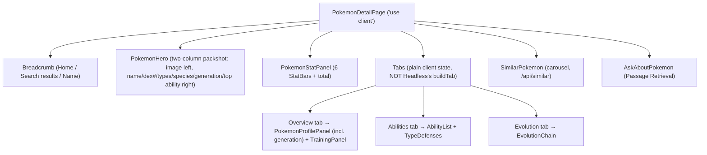
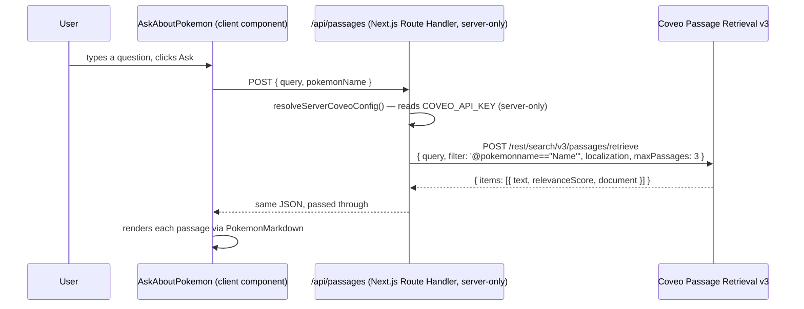

# `/pokemon/[name]` — Pokemon detail page (PDP)

Source: `src/app/pokemon/[name]/page.tsx`

## Component tree



`PokemonHero` is a two-column "commerce packshot" layout (large sprite panel left, identity/types/quick-facts right), not a single stacked column overlapping a full-bleed backdrop photo as an earlier version had. A separate `PdpHighlights` component that briefly existed alongside that backdrop was deleted the same session — its one genuinely new field, `generation`, folded into `PokemonHero`'s quick-facts row and `PokemonProfilePanel` instead of getting its own section. See [ADR-0017](../adr/0017-home-hero-reverted-to-static-banner-pdp-highlights-folded-in.md).

`SimilarPokemon` (below the tabs, above `AskAboutPokemon`) is a carousel of same-type Pokemon backed by `/api/similar` — a deterministic Search API v2 query, not a Content Recommendation model (ADR-0014 resolved that decision; ADR-0015 explains why the query runs through a server route rather than a second client-side engine). Built to the idle/loading/success/error state contract from `docs/EXECUTION-PLAN-async-ui-states.md`, same as `AskAboutPokemon` below it — see that doc and ADR-0016 for the pattern shared across both.

## Controllers and the exact-match query strategy

| Controller | Purpose |
|---|---|
| `buildResultList` | Backs `useControllerState` for this page's single-item result |
| `buildSearchBox` | Used only to reset text to `""` and call `.submit()` — never shows typed text to the user here |

Instead of a free-text search, `page.tsx:76-88` dispatches an **exact-match constant query expression** directly:

```ts
const escapedName = name.replace(/"/g, '\\"');
engine.dispatch(updateAdvancedSearchQueries({ aq: `@pokemonname=="${escapedName}"` }));
searchBox.updateText("");
searchBox.submit();
```

This exists because pokemondb.net page titles are things like *"Bulbasaur Pokédex: stats, moves, evolution & locations"*, not the bare name — a free-text `.find()` against `result.title` would (and, historically, did) always miss. The `aq` (advanced query) filter, not the query text, is what actually finds the Pokemon; `searchBox.updateText("")` is deliberate, not incidental — sending the name as query text instead would fire RGA's "Query is not empty" condition, which this page doesn't want (see below).

A `lastSubmittedName` ref guards against React Strict Mode's double-invoke of the mount effect firing two submits back to back.

## Why Passage Retrieval, not RGA, on this page

RGA (`GeneratedAnswer`, see [`02-search-page.md`](02-search-page.md)) is a `/search`-only surface — it needs a real, non-empty free-text query to fire its "Query is not empty" pipeline condition, which conflicts with this page's empty-query, `aq`-only strategy above. Instead, the PDP's AI surface is **Passage Retrieval**, via `AskAboutPokemon.tsx`:



`AskAboutPokemon` is deliberately **not** a Headless controller — it calls this app's own `/api/passages` route, not the Coveo Search API directly, so there's no engine state to subscribe to; plain `fetch` + local `AskState` union (`idle`/`loading`/`error`/`success`) is the right amount of machinery. `SUGGESTED_QUESTIONS` (`AskAboutPokemon.tsx:14-18`) are hand-authored prompt strings scoped to content that's actually answerable (evolution, abilities, moves) — static UI copy, not indexed data, and explicitly not the mockup's unanswerable "Best team comps"/"How to train for PvP" prompts.

The request's real schema (`filter`, not `aq`/`cq`, plus a required `localization` object) was confirmed by testing against the live endpoint, not assumed from this app's other Search API v2 calls — see ADR-0008 for the full story of why the original implementation's assumptions were wrong.

## `Tabs` — plain client state, not a Headless controller

`src/components/ui/Tabs.tsx` is ordinary `useState` + full keyboard-accessible ARIA (`role="tablist"`/`"tab"`/`"tabpanel"`, roving tabindex, arrow-key navigation) — explicitly **not** Headless's `buildTab` controller, which switches between different *query* constant expressions (e.g. different `aq` per tab) and would be the wrong abstraction for switching between panels of one already-loaded result.

## Data mapping

Every value rendered on this page passes through `mapPokemonResult` (`src/coveo/mapPokemonResult.ts`) — the single mapper boundary from a raw Headless `Result` to the app's `PokemonItem` model. Two things worth calling out to a technical audience:

- `evolution.to` is typed `string[]` but the source field (`pokemonevolvesto`) is single-valued for a branching evolution (e.g. Eevee) — only the first branch is ever captured at extraction. The array typing is intentionally forward-compatible if the source selector is upgraded later; today it holds 0 or 1 entries, and nothing in the UI pretends otherwise.
- `breeding.genderRatio` is genuinely multi-part at the source (e.g. two `<span>`s: "87.5% male" / "12.5% female"), joined with `", "` here rather than read with a single-value accessor that would silently drop half the data for every normal (non-genderless) species.

## Static vs. dynamic

Everything shown — stats, types, species, height/weight, abilities, egg data, weaknesses/resistances, evolution chain — is fetched per render from the live index via the `aq` exact-match query above; nothing is hardcoded or cached from a prior visit. The only static content on this page is `SUGGESTED_QUESTIONS`' copy and structural labels (e.g. `STAT_ORDER`'s display labels in `src/coveo/pokemonStats.ts`, which mirror pokemondb.net's own terminology so nothing is renamed).

## Client vs. server

`"use client"` — needs `useParams`/`useSearchParams` (the `?from=` breadcrumb param), the live browser-side engine, and interactive state (`Tabs`, `AskAboutPokemon`'s form). No server-rendered data path.

## Context API

None read directly by this page's own code. `AppHeader`'s compact `SearchBox` (shown only on this route) and the ambient `CompareProvider`/`CompareTray` are structural, not something this page's component reads.
