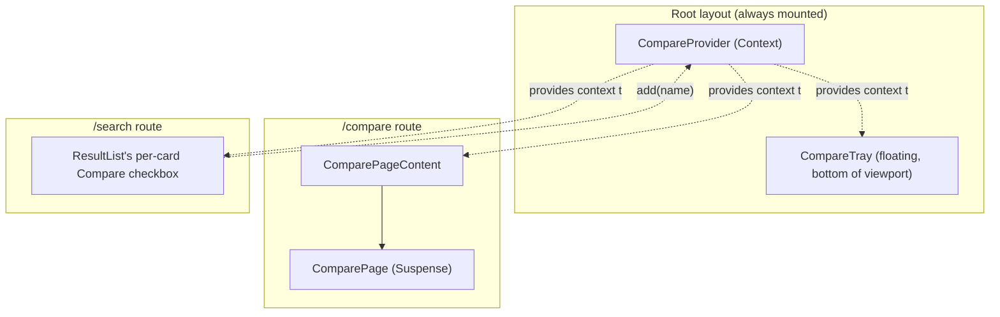

# `/compare` — Comparison page

Source: `src/app/compare/page.tsx`, plus two always-mounted pieces from the root layout: `src/components/compare/CompareProvider.tsx` and `CompareTray.tsx`.

## Component tree



The selection flow spans three routes: a user checks "Compare" on `/search` result cards (writes to context), sees the floating `CompareTray` accumulate names from anywhere in the app, then clicks through to `/compare?names=A,B,C` to see the actual table.

## Context API — the deep-dive

This is the one page most dependent on React Context in the app. `CompareContext` (`CompareProvider.tsx:21-29`):

```ts
interface CompareContextValue {
  names: string[];
  isSelected: (name: string) => boolean;
  isFull: boolean;       // names.length >= MAX_COMPARE_NAMES (4)
  add: (name: string) => void;
  remove: (name: string) => void;
  clear: () => void;
  max: number;
}
```

- **Initialized synchronously** from `sessionStorage` via a lazy `useState` initializer (`readCompareNames(window.sessionStorage)`) — avoids a flash of "empty tray" before an effect runs.
- **Mirrored back to `sessionStorage`** on every change via a `useEffect`.
- **`sessionStorage`, not `localStorage`** — a deliberate choice (ADR-0009): tab-scoped, cleared on tab close, which honestly represents transient UI state rather than implying a saved account/collection the app's no-account design (ADR-0004) doesn't actually support.
- All storage reads/writes are wrapped in try/catch in `src/coveo/compareStorage.ts` — a private-browsing window can make `sessionStorage` throw synchronously, and the in-memory React state still works even if persistence silently fails.
- Capped at `MAX_COMPARE_NAMES = 4`; `addCompareName` is a no-op past the cap or for a duplicate, never producing a 5th entry or a repeat.

## Controllers — same exact-match pattern as the PDP, extended to a list

| Controller | Purpose |
|---|---|
| `buildResultList` | Backs the comparison table's rows |
| `buildSearchBox` | Reset-and-submit only, same as the PDP |

`ComparePageContent` dispatches:

```ts
engine.dispatch(updateAdvancedSearchQueries({ aq: `@pokemonname==(${quotedNames})` }));
```

— the same `aq` exact-match strategy as `/pokemon/[name]`, extended from a single value to a list match. Runs against the same shared engine singleton as every other page.

## The core guarantee worth stating explicitly to executives

**Only names ever live in Context/`sessionStorage`.** Every stat, type, ability, height, and weight cell rendered in the comparison table is this render's own fresh Search API response — `/compare` always re-resolves the selected names through a live query on mount/param-change, never reads a stat value out of storage. This directly implements the project's "never fabricate, never present stale data as current" principle (see `CLAUDE.md`/`PRODUCT.md`): if a Pokemon's stats were re-indexed differently between when it was added to Compare and when `/compare` is opened, the table always shows the current value, not a snapshot from selection time.

## Static vs. dynamic

Identical shape to the detail page: table structure/row labels (`STAT_ORDER`, from `src/coveo/pokemonStats.ts`) are static app-authored copy; every cell value is live. The "Compare" checkbox label, cap message ("Comparison is full (max 4) — remove one to add another"), and empty-state copy are static UI text.

## Client vs. server

`"use client"` throughout. `/compare` needs `useSearchParams()` for the `?names=` param — and unlike `/pokemon/[name]` (which is dynamic by virtue of its `[name]` route segment), `/compare` has no dynamic segment forcing it dynamic on its own, so the `Suspense` wrapper is what actually opts it out of static prerendering (same underlying Next.js rule as `/search`).
